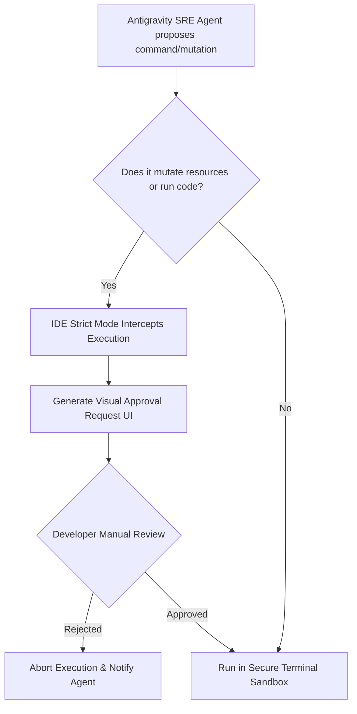

# Antigravity JAX SRE Architecture

[](https://cloud.google.com/)
[](https://www.pulumi.com/)
[](https://github.com/google/jax)
[](https://deepmind.google/)

A production-grade Agentic Site Reliability Engineering (SRE) repository built using the Google Antigravity framework. This project demonstrates clean architectural separation between machine learning code and infrastructure code, featuring multi-folder context modeling, automated provisioning of GPU compute, and strict human-in-the-loop security gates.

---

## Repository Architecture

This repository enforces a strict boundary between ML model execution and Infrastructure as Code (IaC). Below is the project layout:

```text
antigravity-jax-sre/
├── README.md                           <-- [This File] Root Documentation & SRE Architecture Spec
├── jax-model/                          <-- Isolated ML Application Layer (User Space)
│   ├── train.py                        <-- Model logic (JAX, JIT-compiled matrix multiplication)
│   └── requirements.txt                <-- ML-specific python packages (JAX, etc.)
└── cloud-infra/                        <-- Isolated Infrastructure Layer (Ops Space)
    ├── __main__.py                     <-- Pulumi GCP resource definitions (Instance, VPC, GPU)
    ├── Pulumi.yaml                     <-- Pulumi project definition
    └── requirements.txt                <-- Infra-specific python packages (pulumi, pulumi-gcp)
```

---

## Agentic SRE Design Principles

### 1. Multi-Folder Cross-Repository Context Isolation
Unlike traditional monoliths or tightly coupled projects, this repository uses **Multi-Folder Cross-Repository Context**.
*   **[jax-model/](antigravity-jax-sre/jax-model)** contains pure JAX computational code that has zero awareness of cloud provider APIs, regions, or networks.
*   **[cloud-infra/](antigravity-jax-sre/cloud-infra)** contains purely declarative infrastructure configurations defining the VPC, firewall rules, and compute parameters.

The Antigravity SRE agent spans this boundary during analysis to match infrastructure capability to application needs:
1.  **Reads** the [train.py](antigravity-jax-sre/jax-model/train.py) model configuration to identify GPU demands (e.g., CUDA or accelerated matrix multiplications).
2.  **Correlates** dependencies within the [requirements.txt](antigravity-jax-sre/jax-model/requirements.txt).
3.  **Generates and Mutates** the cloud blueprint in [__main__.py](antigravity-jax-sre/cloud-infra/__main__.py) to supply the corresponding hardware (an N1 instance with an attached NVIDIA T4 GPU).

> [!NOTE]
> This separation prevents "dependency pollution," keeping large ML weights/runtimes isolated from lightweight deployment scripts, and ensures the code remains environment-agnostic.

---

## Interactive Human-in-the-Loop Security Gates

To guarantee compliance, auditability, and safety, the infrastructure deployment process utilizes the **Antigravity IDE Strict Mode** for all actions that modify resources or execute commands.



### Key Security Guardrails:
*   **Command Verification**: Operations like `pulumi up`, `gcloud compute`, or `git push` cannot be run autonomously by the agent. The IDE generates a modal prompting the developer for authorization.
*   **Credential Shielding**: Credentials and service account keys are stored strictly in secure environment variables or GCP metadata scopes (`https://www.googleapis.com/auth/cloud-platform`), never hardcoded in scripts.

---

## Core Components

### ML Application Layer
*   **[train.py](/antigravity-jax-sre/jax-model/train.py)**: Performs JIT-compiled matrix multiplication using `jax.jit`. Designed to automatically fall back to CPU or leverage NVIDIA CUDA platforms when guest accelerators are mounted.
*   **[requirements.txt](antigravity-jax-sre/jax-model/requirements.txt)**: Tailored dependency list containing `jax`.

### Infrastructure as Code Layer
*   **[__main__.py](antigravity-jax-sre/cloud-infra/__main__.py)**: Declares resources using the `pulumi_gcp` provider:
    *   **VPC Network**: Custom VPC named `jax-gpu-cluster`.
    *   **Subnetwork**: Dedicated subnet in `us-central1` with Private Google Access enabled.
    *   **Firewall Rule**: Restricted SSH ingress (Port 22) scoped to targets with `ssh-enabled` tags.
    *   **Compute Instance**: An `n1-standard-4` machine in `us-central1-a` containing one attached `nvidia-tesla-t4` GPU and appropriate guest-accelerator scheduling tags (`on_host_maintenance="TERMINATE"`).

> [!IMPORTANT]
> The instance uses GCP scheduling configurations which terminate the instance during host maintenance events, as live migration is not supported for instances with attached GPUs.

---

## Getting Started

### Prerequisites
*   [Pulumi CLI](https://www.pulumi.com/docs/install/) installed.
*   [Google Cloud SDK (gcloud)](https://cloud.google.com/sdk/docs/install) authenticated.
*   A GCP project set with a sufficient quota for **NVIDIA T4 GPUs** in region `us-central1`.

### Local Deployment Workflow

1.  **Initialize local configuration and virtual environments**:
    ```bash
    cd jax-model && python -m venv .venv && source .venv/bin/activate
    pip install -r requirements.txt
    ```

2.  **Verify local JAX execution (defaults to CPU without driver)**:
    ```bash
    python train.py
    ```

3.  **Deploy Cloud Infrastructure via Pulumi**:
    ```bash
    cd ../cloud-infra
    python -m venv .venv && source .venv/bin/activate
    pip install -r requirements.txt
    pulumi stack init dev
    pulumi up
    ```

> [!WARNING]
> Running `pulumi up` will trigger the **Antigravity IDE human-in-the-loop validation request**. Confirm the resource changes inside your IDE popup to start provisioning GCP resources.
